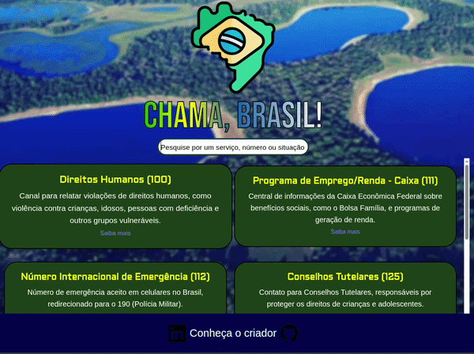

  

# 
 📞 Objetivo do Projeto 🇧🇷

Criar um local unificado, simples e visualmente agradável onde qualquer pessoa possa:

✔ Encontrar rapidamente telefones de emergência,

✔ Entender a função de cada serviço,

✔ Ser redirecionada a um site com mais informações sobre o número apresentado.

Se trata de um buscador interativo de telefones de emergência do Brasil.
Este projeto é uma aplicação web simples e intuitiva que reúne todos os principais números de emergência e utilidade pública do Brasil (100–199), permitindo que o usuário pesquise por nome, número ou descrição dos serviços.

A interface é responsiva, rápida e apresenta cada serviço em cards organizados dinamicamente, com busca em tempo real.

# Principais pontos fortes 
🔎 Busca instantânea por nome, número ou descrição;

📇 Cards dinâmicos gerados a partir de um arquivo JSON;

📱 Design responsivo;

🎨 Interface moderna com imagem de fundo, gradientes e animações;

🔗 Links para cada serviço;

⚡ Carregamento automático dos dados ao iniciar a página.

# Tecnologias Utilizadas

HTML5;

CSS3;

JavaScript (ES6+);

JSON.

Recursos externos:

Google Fonts;

Ícones SVG.

# 🔎 Como funciona a busca

O script: carrega o data.json;

Remove acentos e deixa todas as letras minúsculas para facilitar a pesquisa;
Compara o termo com:

  Nome do serviço;
  
  Descrição;
  
  Número;
  
  E então atualiza os cards dinamicamente.

  <h3 align="center">Acesse a página do projeto por <a href="https://miguelreisb.github.io/Chama-Brasil/" target="_blank">Aqui</a>.</h3>

# <h2 align="center">Chama, Brasil!</h2>
